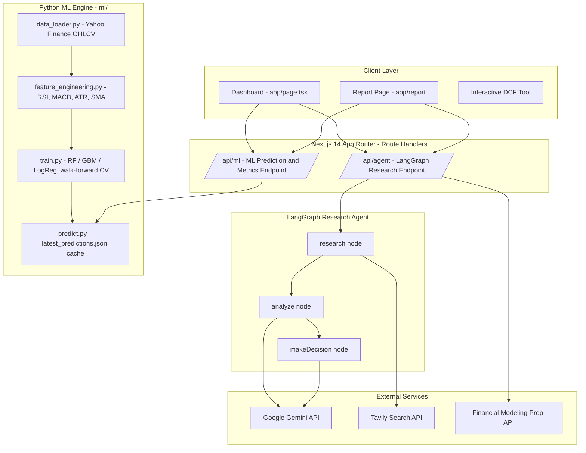
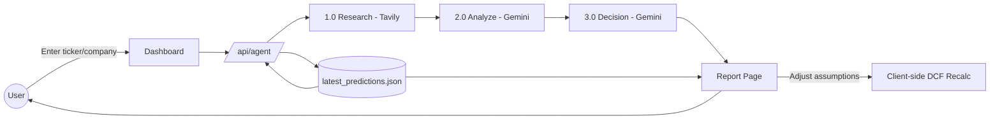

# InvestIQ — AI Investment Research Agent for Indian Equities

> A Next.js 14 platform that runs a multi-agent LangGraph pipeline (research → analyze → decide) over Gemini and Tavily Search to produce institutional-style equity research reports on Indian stocks, backed by a real quantitative ML engine (Random Forest / Gradient Boosting on technical indicators) and a client-side DCF valuation tool.

**Tagline:** *Search a ticker. Get a verdict — backed by data, not vibes.*

---

## 🎯 Problem Statement

Retail investors in India either rely on scattered broker notes and forum "tips," or pay for institutional research they don't have access to. There's no single place that combines live market data, AI-generated qualitative research, and an honestly-validated quantitative signal in one report — most "AI stock picker" tools either hide their model's real accuracy or skip data-driven signals entirely. InvestIQ centralizes this: a LangGraph research agent gathers and synthesizes news/fundamentals, a trained ML engine scores short-term direction with disclosed AUC (not fake confidence), and a DCF tool lets the user stress-test the valuation themselves.

---

## ✨ Key Features

- 🔎 **Ticker-based research agent** — LangGraph state machine (research → analyze → decide) using Gemini for synthesis and Tavily Search for live web/news context
- 📊 **Quantitative ML signal engine** — RandomForest/GradientBoosting/LogisticRegression classifiers on technical indicators (RSI-14, MACD histogram, %-above-SMA50/200, NATR volatility), multi-horizon targets (5/21/60-day), walk-forward validated
- 🧪 **Honest signal labeling** — surfaces real backtested AUC (~0.53 "weak edge") and recent-fold-only strength instead of inflated confidence scores
- 💹 **Real market data** — Financial Modeling Prep integration for live fundamentals/pricing
- 🧮 **Interactive DCF valuation tool** — lets the user adjust growth/discount assumptions and see fair value recompute client-side
- 🏛️ **Institutional-style report page** — dossier-format writeup with decision (INVEST/PASS), reasoning, source citations, and market snapshot (NIFTY 50, SENSEX, USD/INR, India VIX)
- 🎯 **Top picks & sector heatmap** on the dashboard
- 🧵 **Full agent trace logs** — every research step is logged and shown, not a black box
- 🐍 **Standalone Python ML pipeline** — `ml:data` → `ml:train` → `ml:predict` scripts, separate from the Next.js app
- 🔐 *(planned)* Persistence + auth via Supabase — save reports per user instead of localStorage-only

---

## 👥 Roles

| Role                   | Responsibilities                                                             |
| ---------------------- | ---------------------------------------------------------------------------- |
| Sumit Raj Verma        | Front-end                                                                    |
| Nitin                  | Cloud                                                                        |
| Aditya Pratap Singh    | AI/ML                                                                        |
| Ritesh                 | Cloud                                                                        |
| Tanish Yadav           | Backend                                                                      |
| Ashu Singh             | Backend                                                                      |
---


## 🧠 Core Pipeline

### 1. Research Agent (LangGraph)

A 3-node compiled state graph:

```
START → research → analyze → makeDecision → END
```

- **research** — queries Tavily for live news/context on the company, appends to a growing `searchResults[]` log
- **analyze** — sends aggregated research to Gemini, produces `analysisReport`
- **makeDecision** — Gemini reduces the analysis to a final `decision` (`INVEST` / `PASS`) with `reasoning`

State is a single `AgentState` object threaded through every node (company name, logs, search results, report, decision, reasoning, error).

### 2. ML Signal Scoring

```
signalScore = trained_classifier(technicalIndicators) → probability by horizon (5d / 21d / 60d)
```

Trained per-ticker on historical OHLCV panel data (10 large-cap NSE tickers), 3-fold walk-forward validated to avoid lookahead leakage, model selected by AUC per horizon. Best result: GradientBoosting @ 21-day horizon, avg AUC 0.533 — reported as-is, including the fact that the edge fades in the most recent fold.

### 3. DCF Valuation

Client-side discounted cash flow calculator on the report page — user-adjustable growth/discount/terminal-value inputs recompute fair value instantly, no server round-trip.

---

## 🏗️ System Architecture



---

## 📊 Data Flow — Report Generation



> Diagrams reflect the current Next.js 14 architecture. The legacy Express/Vite server in `server/` is kept as a secondary backend and is not part of the primary flow above.

---

## 🚀 Getting Started

### Prerequisites

- Node.js (v18+)
- Python 3.9+ (for the ML pipeline)
- API keys: Google Gemini, Tavily Search, Financial Modeling Prep (optional)

### Setup

```bash
# Clone the repo
git clone <your-repo-url>
cd "AI Investment Research Agent"

# Install Node dependencies
npm install

# (Optional) Install Python ML dependencies
cd ml && pip install -r requirements.txt && cd ..
```

### Environment Variables

Copy `.env.local.example` to `.env.local`:

```bash
cp .env.local.example .env.local
```

```
GEMINI_API_KEY=your_gemini_api_key_here
TAVILY_API_KEY=your_tavily_api_key_here
FMP_API_KEY=your_fmp_api_key_here
NODE_ENV=development
PORT=3000
```

### Run locally

```bash
# App
npm run dev

# ML pipeline (optional, run in order)
npm run ml:data
npm run ml:train
npm run ml:predict
```

---

## 🗓️ Build Roadmap

- [x] LangGraph research agent (research → analyze → decide)
- [x] Real market-data API integration (FMP)
- [x] Python ML engine — technical-indicator classifiers, walk-forward validated
- [x] Interactive DCF valuation tool
- [ ] Port DCF tool back into the live Next.js report page (currently only in legacy `server/`)
- [ ] Persistence + auth (Supabase — Postgres + Auth)
- [ ] Automated tests across agent + ML pipeline
- [ ] Source citations inline in the generated report
- [ ] API rate limiting
- [ ] Multi-stage DCF (bear/base/bull scenarios)
- [ ] Report versioning / diffing

---

## 📄 License

This project is developed as an academic/personal project.
