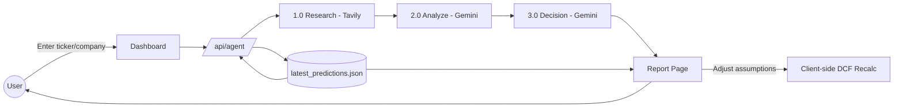

# InvestIQ — AI Investment Research Agent for Indian Equities

> A full-stack investment research platform for Indian stocks combining live NSE market data, AI-generated company briefs, technical signal analysis, and financial performance tracking.

**Tagline:** *Search a ticker. Get a verdict — backed by data, not vibes.*

---
## 🎯 Problem Statement

Retail investors in India either rely on scattered broker notes and forum "tips," or pay for institutional research they don't have access to. There's no single place that combines live market data, AI-generated qualitative research, and an honestly-validated quantitative signal in one report — most "AI stock picker" tools either hide their model's real accuracy or skip data-driven signals entirely. InvestIQ centralizes this: a LangGraph research agent gathers and synthesizes news/fundamentals, a trained ML engine scores short-term direction with disclosed AUC (not fake confidence), and a DCF tool lets the user stress-test the valuation themselves.


---

## ✨ Key Features

- 🔎 **Ticker-based research agent** — LangGraph state machine (research → analyze → decide) using Gemini for synthesis and Tavily Search for live web/news context
- 📊 **Quantitative ML signal engine** — RandomForest/GradientBoosting/LogisticRegression classifiers on technical indicators (RSI-14, MACD histogram, %-above-SMA50/200, NATR volatility), multi-horizon targets (5/21/60-day), walk-forward validated
- 🧪 **Honest signal labeling** — surfaces real backtested AUC (~0.53 "weak edge") and recent-fold-only strength instead of inflated confidence scores
- 💹 **Real market data** — NSE India (`stock-nse-india`) integration with yfinance fallback for live fundamentals/pricing
- 🧮 **Interactive DCF valuation tool** — lets the user adjust growth/discount assumptions and see fair value recompute client-side
- 🏛️ **Institutional-style report page** — dossier-format writeup with signal (BUY/HOLD/AVOID), reasoning, and market snapshot (NIFTY 50, SENSEX, USD/INR, India VIX)
- 🎯 **Top picks & sector heatmap** on the dashboard
- 🧵 **Full agent trace logs** — every research step is logged and shown, not a black box
- 🐍 **Standalone Python ML pipeline** — `ml:data` → `ml:train` → `ml:predict` scripts, separate from the Next.js app
- 🔐 *(planned)* Persistence + auth via Supabase — save reports per user instead of localStorage-only

---

## 👥 Roles

| Role                   | Responsibilities                                                             |
| ---------------------- | ---------------------------------------------------------------------------- |
| Sumit Raj Verma        | Front-end                                                                    |
| Nitin                  | Cloud                                                                        |
| Aditya Pratap Singh    | AI/ML                                                                        |
| Ritesh                 | Cloud                                                                        |
| Tanish Yadav           | Backend                                                                      |
| Ashu Singh             | Backend                                                                      |
---


## 🧠 Core Pipeline

### 1. Research Agent (LangGraph)

A 3-node compiled state graph:

```
START → research → analyze → makeDecision → END
```

- **research** — queries Tavily for live news/context on the company, appends to a growing `searchResults[]` log
- **analyze** — sends aggregated research to Gemini, produces `analysisReport`
- **makeDecision** — Gemini reduces the analysis to a final `decision` (`INVEST` / `PASS`) with `reasoning`

State is a single `AgentState` object threaded through every node (company name, logs, search results, report, decision, reasoning, error).

### 2. ML Signal Scoring

```
signalScore = trained_classifier(technicalIndicators) → probability by horizon (5d / 21d / 60d)
```

Trained per-ticker on historical OHLCV panel data (10 large-cap NSE tickers), 3-fold walk-forward validated to avoid lookahead leakage, model selected by AUC per horizon. Best result: GradientBoosting @ 21-day horizon, avg AUC 0.533 — reported as-is, including the fact that the edge fades in the most recent fold.

### 3. DCF Valuation

Client-side discounted cash flow calculator on the report page — user-adjustable growth/discount/terminal-value inputs recompute fair value instantly, no server round-trip.

---

## 🏗️ System Architecture

```mermaid
flowchart TB
    subgraph Client["Client Layer"]
        A1[Dashboard - Vite/React]
        A2[Company Page - Vite/React]
        A3[Watchlist - Vite/React]
    end

    subgraph Server["Express Backend - Port 5000"]
        B1[/api/stocks/:ticker]
        B2[/api/stocks/:ticker/history]
        B3[/api/stocks/:ticker/prediction]
        B4[/api/stocks/:ticker/ai-summary]
        B5[/api/stocks/:ticker/financials]
    end

    subgraph Data["Python Data Service - Port 8000"]
        C1[/price/{ticker}]
        C2[/summary/{ticker}]
        C3[/history/{ticker}]
        C4[/predict/{ticker}]
    end

    subgraph External["External Services"]
        D1[NSE India - stock-nse-india]
        D2[yfinance]
        D3[Groww API]
        D4[OpenAI / Nemotron (optional)]
    end

    A1 --> B1
    A2 --> B1
    A3 --> B1
    A2 --> B2
    A2 --> B3
    A2 --> B4
    A2 --> B5

    B1 --> D1
    B1 -.-> C1
    B1 -.-> C2
    B1 -.-> C3
    B3 -.-> C4
    B5 --> D3
    B4 -.-> D4
```

---

## 📊 Data Flow — Report Generation

```mermaid
flowchart LR
    User((User)) -- Enter ticker/company --> UI[Dashboard]
    UI --> API[/api/stocks/:ticker]
    API --> NSE[1. NSE Primary]
    NSE -.fallback.-> Python[2. Python/yfinance]
    API --> PythonPred[/predict - LinearRegression]
    API --> AI[/ai-summary - OpenAI/Local]
    API --> Groww[/financials - Groww]
    API --> Report[Company Page]
    Report -- Adjust assumptions --> DCF[Client-side DCF Recalc]
    Report --> User
```

---

## 📊 Data Flow — Report Generation



> Diagrams reflect the current Next.js 14 architecture. The legacy Express/Vite server in `server/` is kept as a secondary backend and is not part of the primary flow above.

---

## 🚀 Getting Started

### Prerequisites

- Node.js 18+
- Python 3.9+ (for the ML pipeline)
- MongoDB (local or Atlas)
- Optional: OpenAI API key for AI summaries

### Setup

```bash
# Clone the repo
git clone <your-repo-url>
cd InvestIQ-

# Install all dependencies
npm run install:all

# Install Python data service dependencies
cd data-service && pip install -r requirements.txt && cd ..

# Copy environment files
cp backend/.env.example backend/.env
cp frontend/.env.example frontend/.env

# Start MongoDB (if local)
mongod

# Seed database with top NSE stocks (optional)
npm run seed

# Start all services
# Terminal 1: Python data service
cd data-service && uvicorn app:app --host 0.0.0.0 --port 8000

# Terminal 2: Express backend
npm run dev:backend

# Terminal 3: Frontend
npm run dev:frontend
```

### Environment Variables

**Backend (`backend/.env`):**
```env
NODE_ENV=development
PORT=5000
HOST=0.0.0.0
MONGO_URI=mongodb://localhost:27017/investiq
PYTHON_DATA_SERVICE_URL=http://localhost:8000
FRONTEND_URL=http://localhost:5173
OPENAI_API_KEY=your_key_here
OPENAI_MODEL=gpt-4o-mini
NSE_CACHE_TTL_SECONDS=900
AI_CACHE_TTL_SECONDS=21600
HISTORY_CACHE_TTL_SECONDS=900
REQUEST_TIMEOUT_MS=15000
PYTHON_REQUEST_TIMEOUT_MS=30000
```

**Frontend (`frontend/.env`):**
```env
VITE_API_BASE_URL=http://localhost:5000/api
```

### Run locally

```bash
# All services (3 terminals)
# Terminal 1: Python data service
cd data-service && uvicorn app:app --host 0.0.0.0 --port 8000

# Terminal 2: Express backend
npm run dev:backend

# Terminal 3: Frontend
npm run dev:frontend
```

---

## 🗓️ Build Roadmap

- [x] Express backend with stock data APIs
- [x] NSE live data integration (stock-nse-india)
- [x] Python FastAPI service with yfinance fallback
- [x] Technical signal engine (SMA50/200, RSI14, CAGR, sector P/E)
- [x] 90-day LinearRegression price predictions with R²
- [x] AI company summaries (OpenAI + local fallback)
- [x] Financial data from Groww API
- [x] Multi-layer caching (MongoDB 15min TTL + stale-while-revalidate)
- [x] Watchlist with real-time signals
- [x] Clerk authentication integration
- [x] Render deployment configuration
- [ ] Persistence + auth via Supabase — save reports per user instead of localStorage-only
- [ ] Automated tests across agent + ML pipeline
- [ ] Source citations inline in the generated report
- [ ] API rate limiting
- [ ] Multi-stage DCF (bear/base/bull scenarios)
- [ ] Report versioning / diffing

---

## 📄 License

This project is developed as an academic/personal project.
